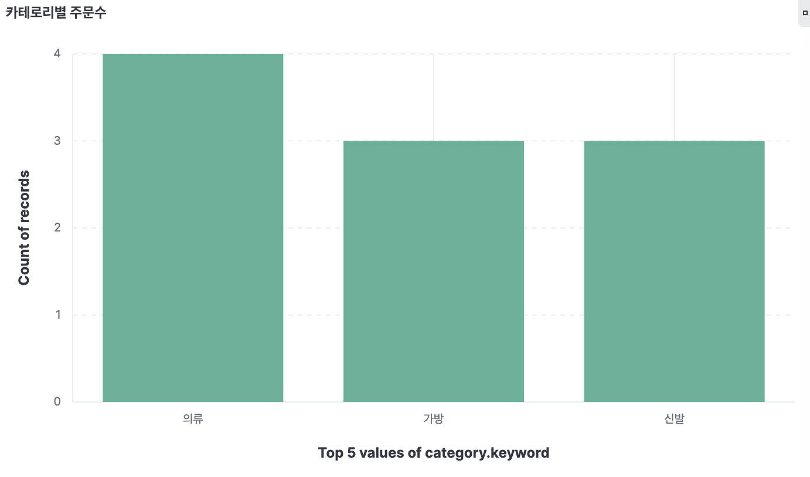
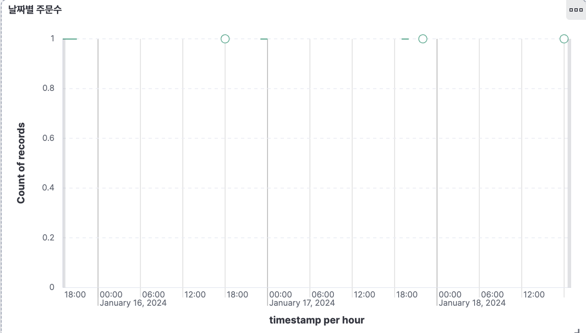
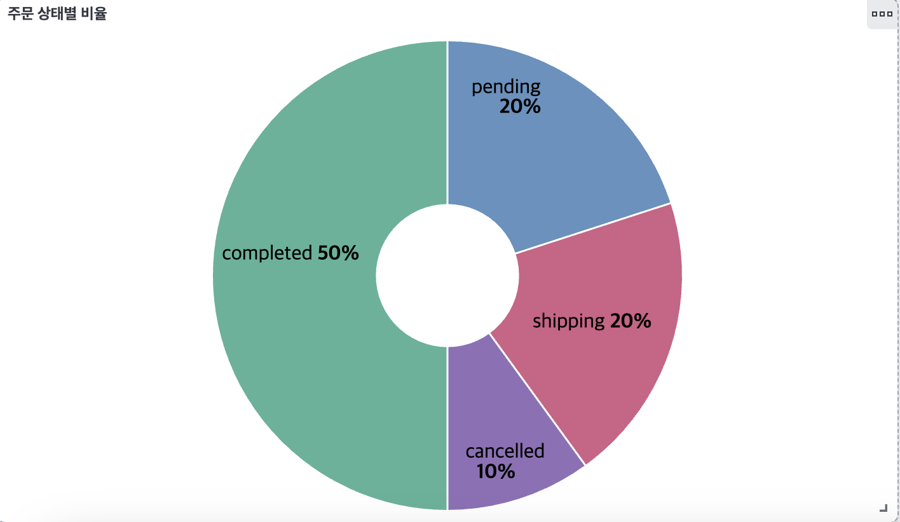

# Kibana 대시보드

## 대시보드 이름: 이커머스 주문현황

### 사용 데이터
- 인덱스: ecommerce-logs
- 기간: 2024-01-15 ~ 2024-01-18
- 문서 수: 10개

---

## 시각화 1 - 카테고리별 주문수 (바 차트)
- 차트 타입: Bar vertical stacked
- X축: category.keyword
- Y축: Count of records
- 결과: 의류 4개, 가방 3개, 신발 3개

---

## 시각화 2 - 날짜별 주문수 (선 그래프)
- 차트 타입: Line
- X축: timestamp (per hour)
- Y축: Count of records
- 결과: 2024-01-15 ~ 2024-01-18 기간 시간별 주문 추이

---

## 시각화 3 - 주문 상태별 비율 (도넛 차트)
- 차트 타입: Donut
- Slice by: status.keyword
- Metric: Count of records
- 결과: completed 50%, pending 20%, shipping 20%, cancelled 10%

