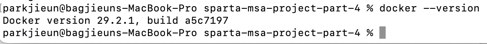
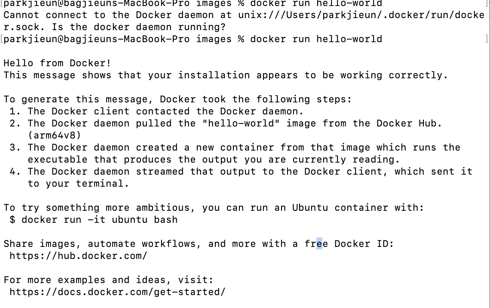
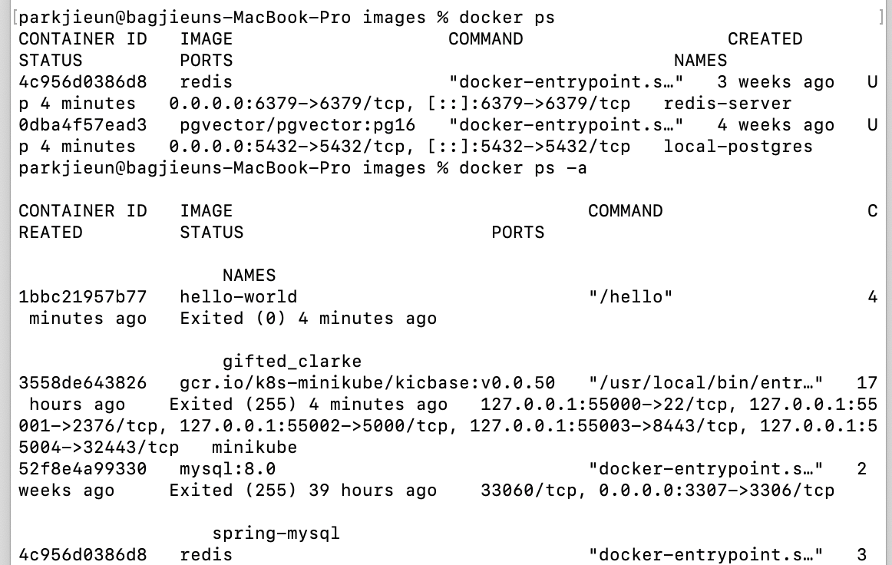
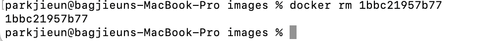
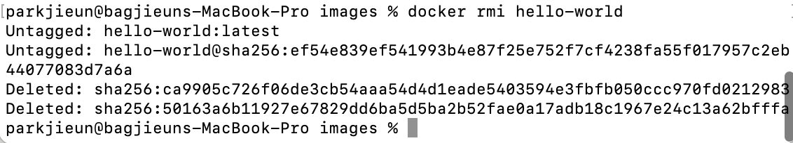

# Docker 기본 명령어 실습

## 1. Docker 버전 확인

Docker가 정상적으로 설치되어 있는지 버전을 확인합니다.

```bash
docker --version
```



---

## 2. 첫 번째 컨테이너 실행

Docker Hub에서 hello-world 이미지를 자동으로 다운받아 실행하고 성공 메시지를 출력합니다.
Docker 설치, Docker Hub 연결, 이미지 다운로드, 컨테이너 실행을 한번에 테스트할 수 있습니다.

```bash
docker run hello-world
```



---

## 3. 실행 중인 컨테이너 확인

현재 실행 중인 컨테이너 목록을 확인합니다.
-a 옵션을 추가하면 종료된 컨테이너까지 모두 확인할 수 있습니다.

```bash
# 실행 중인 컨테이너 확인
docker ps

# 종료된 컨테이너까지 모두 확인
docker ps -a
```



---

## 4. 컨테이너 정리

docker stop은 실행 중인 컨테이너를 중지하고, docker rm은 중지된 컨테이너를 삭제합니다.
컨테이너ID는 docker ps -a에서 확인할 수 있습니다.

```bash
# 컨테이너 중지
docker stop {컨테이너ID}

# 컨테이너 삭제
docker rm {컨테이너ID}
```



---

## 5. 이미지 관리

docker images는 로컬에 저장된 이미지 목록을 확인하고, docker rmi는 이미지를 삭제합니다.
이미지를 삭제하려면 해당 이미지를 사용하는 컨테이너를 먼저 삭제해야 합니다.

```bash
# 이미지 목록 확인
docker images

# 이미지 삭제
docker rmi {이미지명}
```

