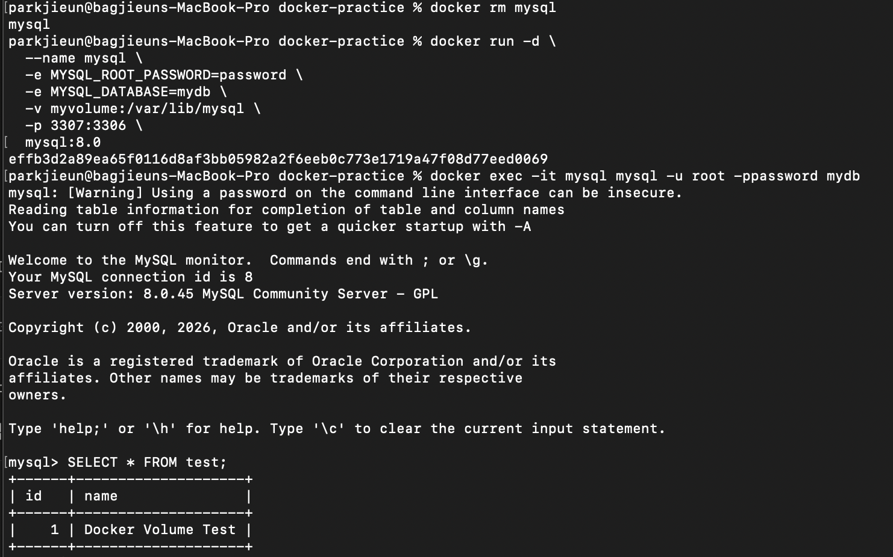

# Docker 볼륨을 활용한 데이터 유지

## 1. Docker 볼륨이란?
컨테이너는 삭제되면 안에 있는 데이터도 함께 사라집니다.
볼륨을 사용하면 컨테이너와 독립적으로 데이터를 저장할 수 있어서
컨테이너가 삭제되어도 데이터가 유지됩니다.

---

## 2. 볼륨 생성

```bash
docker volume create myvolume
```

---

## 3. MySQL 컨테이너 + 볼륨 마운트 실행

-v 옵션으로 볼륨을 마운트합니다.
MySQL 데이터가 myvolume에 저장됩니다.

```bash
docker run -d \
  --name mysql \
  -e MYSQL_ROOT_PASSWORD=password \
  -e MYSQL_DATABASE=mydb \
  -v myvolume:/var/lib/mysql \
  -p 3307:3306 \
  mysql:8.0
```

---

## 4. 데이터 저장

```bash
docker exec -it mysql mysql -u root -ppassword mydb
```

```sql
CREATE TABLE test (id INT, name VARCHAR(50));
INSERT INTO test VALUES (1, 'Docker Volume Test');
SELECT * FROM test;
```


---

## 5. 컨테이너 삭제

```bash
docker stop mysql
docker rm mysql
```

---

## 6. 컨테이너 재실행 후 데이터 유지 확인

같은 볼륨으로 컨테이너를 다시 실행하면 데이터가 유지됩니다.

```bash
docker run -d \
  --name mysql \
  -e MYSQL_ROOT_PASSWORD=password \
  -e MYSQL_DATABASE=mydb \
  -v myvolume:/var/lib/mysql \
  -p 3307:3306 \
  mysql:8.0

docker exec -it mysql mysql -u root -ppassword mydb
```

```sql
SELECT * FROM test;
```



컨테이너를 삭제했다가 다시 실행해도 데이터가 그대로 유지됩니다. ✅