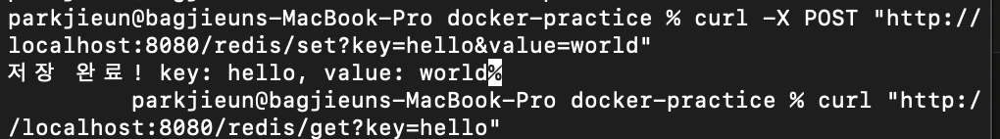
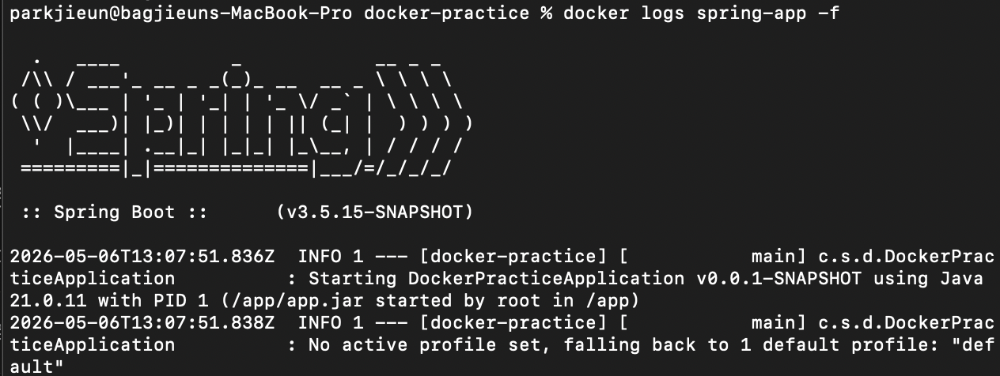

# Docker 네트워크 실습

## 1. Docker 네트워크란?
컨테이너는 기본적으로 격리된 환경에서 실행됩니다.
같은 네트워크에 묶으면 컨테이너끼리 이름으로 서로를 찾아서 통신할 수 있습니다.

---

## 2. 네트워크 생성

```bash
docker network create mynetwork
```

---

## 3. Redis 컨테이너 실행

```bash
docker run -d --name redis --network mynetwork redis:alpine
```

---

## 4. Spring 앱 컨테이너 실행

```bash
docker run -d -p 8080:8080 --name spring-app --network mynetwork docker-practice
```

---

## 5. Spring 앱 Redis 연동

### application.yaml
같은 네트워크에 있으면 컨테이너 이름으로 호스트를 지정할 수 있습니다.

```yaml
spring:
  data:
    redis:
      host: redis
      port: 6379
```

### RedisController.java
Redis에 데이터를 저장하고 조회하는 API를 구현합니다.

```java
@RestController
@RequestMapping("/redis")
public class RedisController {

    private final StringRedisTemplate redisTemplate;

    public RedisController(StringRedisTemplate redisTemplate) {
        this.redisTemplate = redisTemplate;
    }

    @PostMapping("/set")
    public String setValue(@RequestParam String key, @RequestParam String value) {
        redisTemplate.opsForValue().set(key, value);
        return "저장 완료! key: " + key + ", value: " + value;
    }

    @GetMapping("/get")
    public String getValue(@RequestParam String key) {
        String value = redisTemplate.opsForValue().get(key);
        return "조회 결과 - key: " + key + ", value: " + value;
    }
}
```

---

## 6. API 테스트 결과

```bash
# 데이터 저장
curl -X POST "http://localhost:8080/redis/set?key=hello&value=world"

# 데이터 조회
curl "http://localhost:8080/redis/get?key=hello"
```



---

## 7. 로그 확인

```bash
# 실시간 로그 확인
docker logs spring-app -f

# 최근 10개 로그만 확인
docker logs --tail 10 spring-app
```

