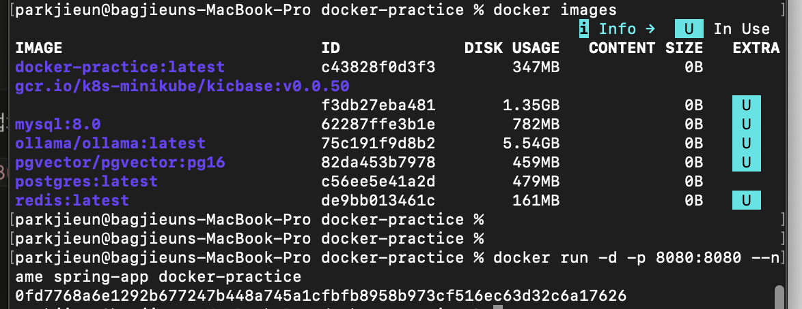

# Spring Boot 웹 애플리케이션 Docker 이미지 생성

## 1. Spring Boot 애플리케이션 작성

간단한 REST API를 작성합니다.

```java
@RestController
public class HelloController {

    @GetMapping("/")
    public String hello() {
        return "Hello Docker!";
    }
}
```

---

## 2. Dockerfile 작성

멀티스테이지 빌드를 사용하여 이미지 크기를 최적화합니다.
빌드 환경과 실행 환경을 분리하여 최종 이미지에는 실행에 필요한 파일만 포함합니다.

```dockerfile
# 1단계: 빌드 환경
FROM gradle:8.5-jdk21 AS builder

WORKDIR /app

COPY build.gradle settings.gradle gradlew ./
COPY gradle ./gradle

RUN chmod +x gradlew
RUN ./gradlew dependencies --no-daemon

COPY . .
RUN chmod +x gradlew
RUN ./gradlew clean bootJar -x test --no-daemon

# 2단계: 실행 환경
FROM amazoncorretto:21-alpine

WORKDIR /app

COPY --from=builder /app/build/libs/*.jar app.jar

EXPOSE 8080

ENTRYPOINT ["java", "-jar", "app.jar"]
```

---

## 3. Docker 이미지 빌드

Dockerfile을 기반으로 이미지를 생성합니다.

```bash
docker build -t docker-practice .
```



---

## 4. 컨테이너 실행

생성된 이미지를 기반으로 컨테이너를 실행합니다.
-d 옵션으로 백그라운드 실행, -p 옵션으로 포트를 매핑합니다.

```bash
docker run -d -p 8080:8080 --name spring-app docker-practice
```

