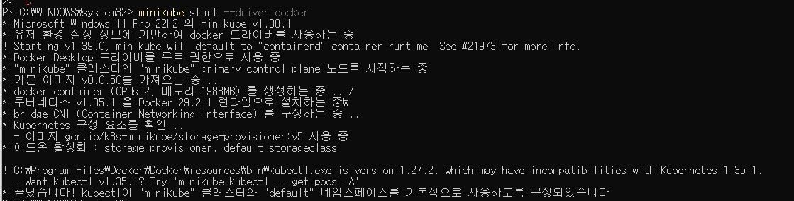
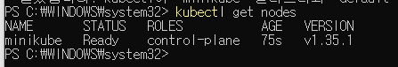
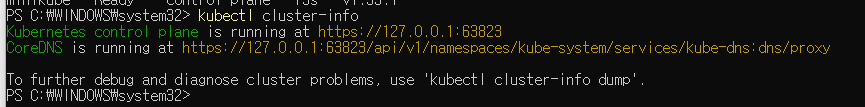

# Minikube 설치 및 클러스터 구성

## 1. Minikube 시작
```bash
minikube start --driver=docker
```


## 2. Kubernetes 노드 상태 확인
```bash
kubectl get nodes
```


## 3. 클러스터 정보 확인
```bash
kubectl cluster-info
```
