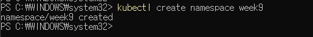
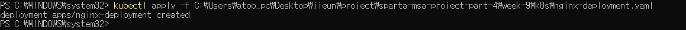
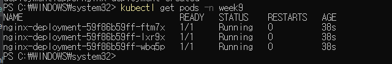
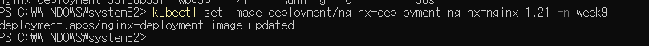
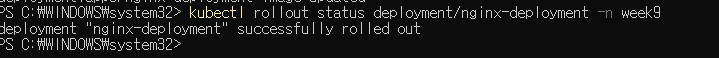

# Deployment 관리

## 1. Namespace 생성
```bash
kubectl create namespace week9
```


## 2. Nginx Deployment 생성 (replicas: 3)
```yaml
apiVersion: apps/v1
kind: Deployment
metadata:
  name: nginx-deployment
  namespace: week9
spec:
  replicas: 3
  selector:
    matchLabels:
      app: nginx
  template:
    metadata:
      labels:
        app: nginx
    spec:
      containers:
      - name: nginx
        image: nginx:latest
        ports:
        - containerPort: 80
```

```bash
kubectl apply -f nginx-deployment.yaml
```


## 3. Pod 실행 확인
```bash
kubectl get pods -n week9
```


## 4. 롤링 업데이트 (nginx:1.21)
```bash
kubectl set image deployment/nginx-deployment nginx=nginx:1.21 -n week9
```


## 5. 롤링 업데이트 상태 확인
```bash
kubectl rollout status deployment/nginx-deployment -n week9
```
