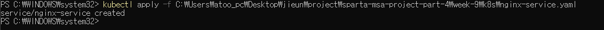
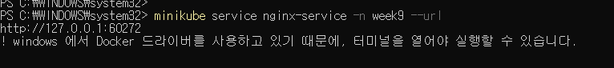
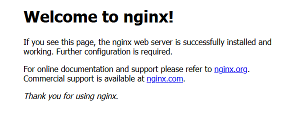
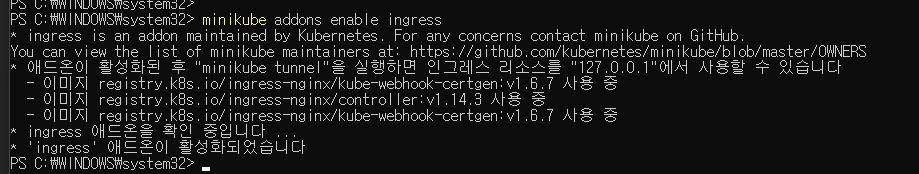

# Service 및 Ingress 설정

## 1. Nginx Service 생성 (NodePort)
```yaml
apiVersion: v1
kind: Service
metadata:
  name: nginx-service
  namespace: week9
spec:
  selector:
    app: nginx
  ports:
  - protocol: TCP
    port: 80
    targetPort: 80
    nodePort: 30080
  type: NodePort
```

```bash
kubectl apply -f nginx-service.yaml
```


## 2. 외부 접근 확인
```bash
minikube service nginx-service -n week9 --url
```


## 3. 브라우저 접속 확인


## 4. Ingress 컨트롤러 활성화
```bash
minikube addons enable ingress
```
