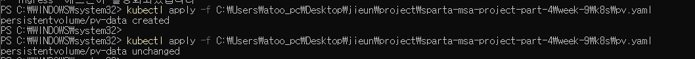
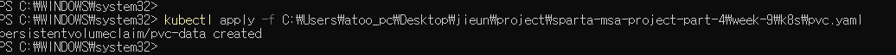
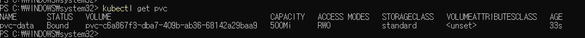

# Persistent Volume & PVC

## 1. PV 생성
```yaml
apiVersion: v1
kind: PersistentVolume
metadata:
  name: pv-data
spec:
  capacity:
    storage: 1Gi
  accessModes:
    - ReadWriteOnce
  hostPath:
    path: "/mnt/data"
```

```bash
kubectl apply -f pv.yaml
```


## 2. PVC 생성
```yaml
apiVersion: v1
kind: PersistentVolumeClaim
metadata:
  name: pvc-data
spec:
  accessModes:
    - ReadWriteOnce
  resources:
    requests:
      storage: 500Mi
```

```bash
kubectl apply -f pvc.yaml
```


## 3. PVC 바인딩 확인
```bash
kubectl get pvc
```
